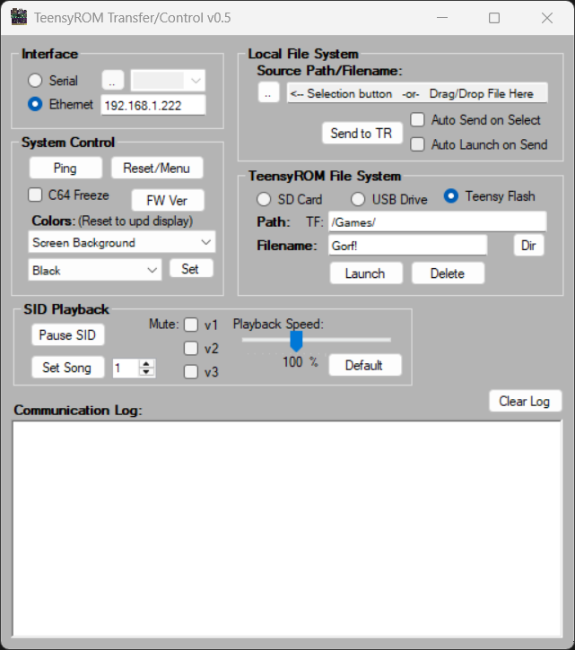

# TR Transfer/Control Application
Minimal Win App for to remotely control your C64/128 via TeensyROM and a USB or Ethernet connection.

* Windows:
  * Run "C64Transfer vX.Y.exe"
* MacOS:
  * brew install wine-stable
  * wine C64Transfer\ vX.Y.exe
* Linux: (Not tested)
  * wine in Linux with package manager like apt-get or yum

I use it mostly for testing and interface development. For a vastly improved UI experience, use [the TeensyROM-UI](https://github.com/MetalHexx/TeensyROM-UI) :)

